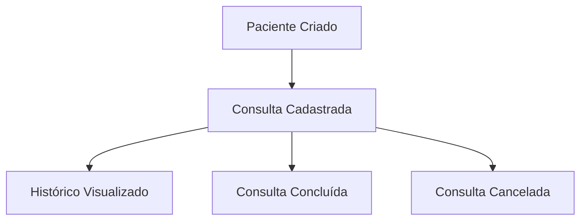
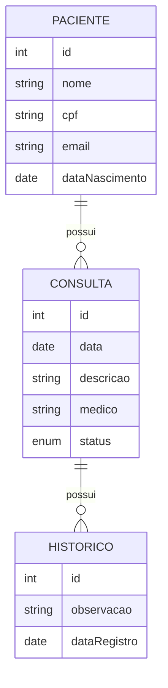

# 🏥 Sistema de Gerenciamento de Clínica

Sistema CRUD completo para gerenciamento de **Pacientes**, **Consultas** e **Histórico Médico**, com fluxo de status e exclusão lógica.

---

## 📌 Funcionalidades

- Cadastro, listagem, edição e exclusão lógica de **Pacientes**
- Cadastro, listagem, edição e cancelamento de **Consultas**
- Registro e visualização do **Histórico** de consultas
- Autocomplete para seleção de pacientes
- Fluxo de status de consulta: `ABERTA → CONCLUIDA / CANCELADA`
- Organização por **steps** no front-end: Paciente → Consulta → Histórico
- Front-end em Angular 19 (Standalone Components)
- Back-end com Spring Boot e banco de dados H2

---

## 🧱 Tecnologias Utilizadas

### 🔤 Front-End
- [Angular 19](https://angular.io/)
- Angular Material
- TypeScript
- Standalone Components

### 🖙 Back-End
- [Spring Boot](https://spring.io/projects/spring-boot)
- Spring Data JPA
- H2 Database (in-memory)
- Java 17+

---

## 🧽 Fluxo de Navegação



---

## 📃 Diagrama Entidade-Relacionamento



---

## 🚀 Como Executar o Projeto

### 1. Back-End

```bash
cd backend
./mvnw spring-boot:run
```

Acesse: [http://localhost:8080/swagger-ui.html](http://localhost:8080/swagger-ui.html)

---

### 2. Front-End

```bash
cd frontend
npm install
ng serve
```

Acesse: [http://localhost:4200](http://localhost:4200)

---

## 📂 Endpoints Principais (API)

| Método | Endpoint                  | Descrição                     |
|--------|---------------------------|-------------------------------|
| GET    | `/api/pacientes`          | Lista todos os pacientes      |
| POST   | `/api/pacientes`          | Cadastra um novo paciente     |
| PUT    | `/api/pacientes/{id}`     | Atualiza paciente             |
| DELETE | `/api/pacientes/{id}`     | Exclui logicamente paciente   |
| GET    | `/api/consultas`          | Lista todas as consultas      |
| GET    | `/api/consultas/paciente/{id}` | Lista consultas de um paciente |
| POST   | `/api/consultas`          | Cadastra nova consulta        |
| PUT    | `/api/consultas/{id}`     | Atualiza status da consulta   |

---

## 🧑‍💻 Autor

Desenvolvido por [Rafael Sales]

---

## 📝 Observações

- O sistema utiliza exclusão lógica para pacientes e consultas (flag `ativo = false` ou `status = CANCELADA`)
- Dados de teste são inseridos automaticamente no banco de dados H2
- O front-end usa MatStepper para guiar o fluxo entre as etapas

---

## 📷 Screenshot


---


